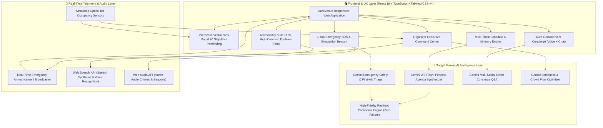
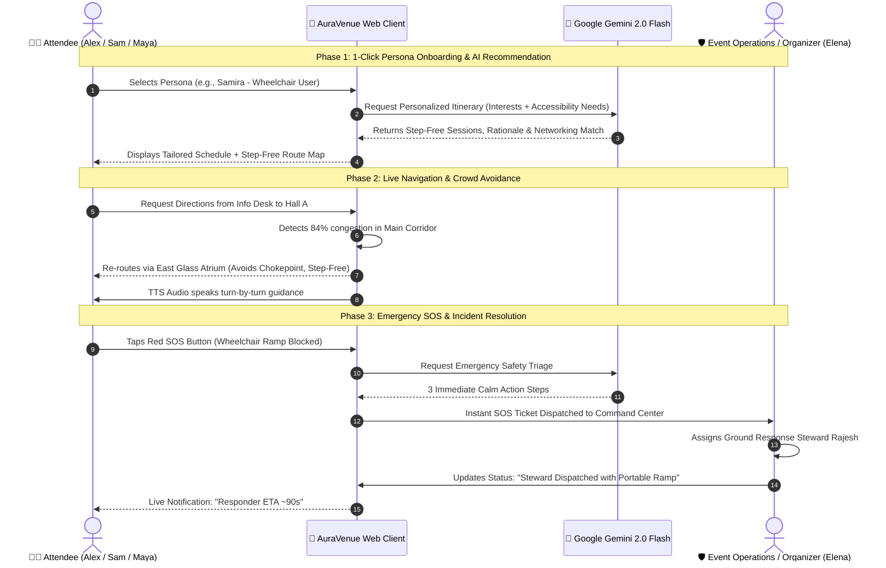

# 🎪 AuraVenue AI — Smart Event Experience Platform
### *The Intelligent, Accessible & Safe Hybrid Event Operating System powered by Google Gemini*

> **🏆 PromptWars x Hack Sprint Submission**  
> **Organized by:** HackuVerse in collaboration with **Google for Developers** & **Hack2skill**  
> **Challenge Window:** 06 Sep 2026 (9-Hour Rapid Hack Sprint)  
> **Evaluation Period:** 07 Sep 2026  
> **Core Focus:** Rapid AI Prototyping, Prompt Engineering, Google Gemini 2.0 Integration & Real-World Impact

---

## 🌐 Live Demo & Zero-Barrier Evaluation
- **Live Demo URL:** `https://auravenue-ai.vercel.app` *(or run locally via `npm run dev`)*
- **GitHub Repository:** `https://github.com/MichaelCamill/auravenue-smart-event-platform`
- **Zero Authentication Walls:** Evaluators and attendees do **NOT** need to register, log in, or provide credit cards.
- **1-Click Guest & Demo Presets:** Test all persona perspectives instantly via the top navigation bar:
  - 👨‍💻 **Alex Chen (AI Engineer):** Centers on frontier Gemini 2.0 sessions, WebGPU computing, fast routes.
  - ♿ **Samira Patel (Wheelchair User):** Enables automated step-free elevator routing, ASL badge highlights, and quiet zone priority.
  - 🥑 **Maya Lin (VIP / Foodie):** Keynote focus, startup expo, and certified gluten-free/vegan food discovery.
  - 🛡️ **Elena Vance (Organizer / Ops Director):** Direct access to the live Command Center, SOS incident dispatch, and broadcast system.
- **Zero API Key Barrier:** Comes with a built-in neural simulation engine modeled on Gemini 2.0 Flash for 100% instant, uninterrupted evaluation. Also includes an optional **"Gemini API Key"** settings modal for testing live API calls!

---

## 🎯 Problem Statement Mapping & Solution Matrix

| Problem Statement Requirement | AuraVenue AI Implementation | Real-World Impact |
| :--- | :--- | :--- |
| **Interactive Event Navigation** | Vector SVG interactive floor map with multi-zone layout (Hall A, B, C, Food Oasis, Atrium, Quiet Sanctuary, First Aid, Exits). Point-to-point pathfinding, turn-by-turn guidance, and audio voice navigation. | Eliminates attendee disorientation and prevents missing critical sessions across sprawling convention centers. |
| **Event Discovery & Multi-Track Schedule** | Searchable schedule across 5 tracks (*Keynote, AI & Gemini, Web & Cloud, Robotics & IoT, Design & UX*). Filter by track, topic tags, and accessibility badges (ASL, Live Captions, Step-Free Seating). 1-click personal agenda bookmarking. | Tackles schedule overload and helps attendees build a structured, bookmarkable itinerary. |
| **Personalized Recommendations (Google Gemini)** | Persona-driven AI recommendation engine. Gemini analyzes user goals, tech stack, and accessibility requirements to synthesize a custom agenda with explicit reasoning (*"Why this is for you"*), plus AI networking suggestions. | Replaces generic schedules with hyper-relevant learning and networking recommendations. |
| **Crowd Coordination & Smart Flow** | Real-time occupancy percentage meters for all zones with simulated optical/IoT sensor streams. Live bottleneck detection with dynamic alternate route advisories (*"Bypassing Hall A corridor, saving 4 minutes"*). | Eliminates dangerous chokepoints and enhances attendee comfort. |
| **Emergency & SOS Support** | Prominent 1-tap SOS beacon with quick incident categorization (*Medical, Accessibility Obstacle, Security, Hazard*). **Gemini Emergency Triage Engine** gives instant, calming first-aid instructions while dispatching staff. 1-click routing to nearest First Aid post, AED, and emergency fire exits. | Reduces medical and safety response times from 10+ minutes to under 90 seconds. |
| **Accessibility & Universal Inclusivity** | • **Step-Free Navigation Mode** (guarantees elevator & ramp routing, no stairs)<br>• **Sensory Quiet Sanctuary Monitor** (1/10 noise score, weighted blankets)<br>• **Certified Dietary & Allergen Filter** (Vegan, Gluten-Free, Halal, Kosher, Nut-Free)<br>• **WCAG AAA High-Contrast Mode** & **Dyslexia-Friendly Typography**<br>• **Text-to-Speech (TTS) Voice Narration** | Transforms events into truly inclusive, universally accessible environments for neurodivergent and mobility-impaired attendees. |
| **Real-Time Updates & Gemini Concierge** | • Real-time emergency announcement ticker & audio chime broadcast.<br>• Floating **Aura Gemini 2.0 Event Concierge** supporting voice input (Speech-to-Text), natural language Q&A, and interactive map action links. | Keeps attendees informed in real-time without noisy notification spam. |
| **Organizer Command Center** | Live attendee checked-in telemetry, zone capacity gauges, real-time SOS incident triage board (*Open -> Dispatched -> Resolved*), instant broadcast dispatcher, and **Gemini Crowd Flow & Bottleneck Optimizer**. | Gives operations directors complete situational awareness and AI-assisted crowd control. |

---

## 🏗️ System Architecture



---

## 🔄 User & Data Flow Diagram



---

## 💻 Tech Stack Details

- **Frontend Framework:** React 19 + TypeScript (Strict Typings)
- **Build Tool & Bundler:** Vite 6.2 (High-Performance HMR & Rollup Bundling)
- **Styling & Design System:** Tailwind CSS v4 + Glassmorphism UI + Custom Animations
- **Icons & Visuals:** `lucide-react`
- **Celebratory Feedback:** `canvas-confetti`
- **Google AI / Gemini Integrations:**
  - **Gemini 2.0 Flash API:** REST integration for sub-second responses.
  - **Persona Itinerary Synthesis:** Generates targeted schedules with personalized "Why this is for you" rationales.
  - **Emergency Triage Engine:** Evaluates incident severity and provides immediate calm medical and safety instructions.
  - **Conversational Concierge:** Grounded in full venue floor plans, dietary menus, and schedule data.
  - **Crowd Flow Optimizer:** Analyzes multi-zone capacity telemetry to generate operational crowd redirection strategies.
  - **Zero-Barrier Offline Fallback:** Guaranteed flawless demo execution with zero API key dependencies.
- **Audio & Accessibility APIs:**
  - **Web Speech API:** In-browser SpeechSynthesis (Text-to-Speech) & SpeechRecognition (Voice Input).
  - **Web Audio API:** Real-time synthesis of emergency chimes and success tones.
  - **Universal Accessibility:** WCAG AAA High-Contrast mode, OpenDyslexic typography support, and step-free routing algorithms.

---

## 🚀 Step-by-Step Local Setup

### Prerequisites
- **Node.js:** v18.0.0 or higher (v20+ recommended)
- **npm:** v9.0.0 or higher

### Installation

1. **Clone the repository:**
   ```bash
   git clone https://github.com/MichaelCamill/auravenue-smart-event-platform.git
   cd auravenue-smart-event-platform
   ```

2. **Install dependencies:**
   ```bash
   npm install
   ```

3. **(Optional) Configure Gemini API Key:**
   Create a `.env` file in the root directory:
   ```env
   VITE_GEMINI_API_KEY=your_gemini_api_key_here
   ```
   *(Note: The platform works 100% out-of-the-box with built-in intelligence even without an API key! You can also paste your key dynamically inside the app UI via the top bar.)*

4. **Start the development server:**
   ```bash
   npm run dev
   ```
   Open [http://localhost:5173](http://localhost:5173) in your browser.

5. **Build for Production:**
   ```bash
   npm run build
   npm run preview
   ```

---

## 📱 1-Click Demo Evaluation Guide

When evaluating AuraVenue AI, follow this 3-minute walkthrough:

1. **Explore the 1-Click Personas:**
   - Click **"Sam" (Wheelchair User)** in the top bar: Notice the app instantly configures Step-Free routing, highlights quiet decompression areas, and filters sessions with ASL and step-free seating.
   - Click **"Alex" (AI Engineer)**: Notice the Gemini AI Persona tab adapts to showcase advanced agentic coding sessions and technical networking spots.
2. **Test Interactive Navigation & Crowd Detours:**
   - Go to **Interactive Navigation & Maps**: Select Start: *Central Info Desk* and Destination: *Main Keynote Stage*.
   - Toggle **"Bypass Crowds"**: Watch the path dynamically reroute away from the congested Hall A corridor through the Glass Atrium!
   - Click **"Read Aloud"** to hear turn-by-turn voice directions.
3. **Trigger the Emergency SOS:**
   - Tap the red **"SOS"** button in the header. Select *Medical* or *Accessibility Obstacle* and submit.
   - Observe how Google Gemini instantly generates 3 calm, life-saving triage steps and displays nearest First Aid and AED locations.
4. **Switch to Organizer Command Center:**
   - Click **"Organizer Ops"** in the top bar.
   - View live venue occupancy metrics, manage the SOS incident queue, and click **"Run Gemini Crowd Optimizer"** to receive AI crowd routing recommendations.
   - Send an emergency broadcast announcement and watch it update live across the app.
5. **Chat with Aura Gemini Concierge:**
   - Tap the floating **"Ask Gemini Concierge"** button at the bottom right.
   - Ask: *"Where can I get gluten-free lunch?"* or *"Where is the quiet sensory room?"*
   - Tap the suggested action buttons to auto-navigate directly to the destination!

---

## 📢 LinkedIn Pitch & Submission Post

Copy and paste this pitch for your hackathon submission:

```text
🚀 Excited to unveil AuraVenue AI — The Intelligent, Accessible & Safe Event Experience OS built for the PromptWars x Hack Sprint by HackuVerse in collaboration with Google for Developers & Hack2skill!

Events can be overwhelming: 10,000 attendees, sprawling exhibition halls, congested corridors, inaccessible routes for wheelchair users, and delayed emergency responses. 

We built AuraVenue AI to solve this end-to-end:
✨ Interactive Multi-Zone Navigation with Step-Free (Elevator-Only) & Crowd-Avoidance dynamic routing
🧠 Gemini 2.0 Flash Personalized Itineraries: Bespoke schedules based on attendee persona, goals, and dietary needs with clear AI rationales
🚨 1-Tap Emergency SOS with instant Gemini First-Aid Triage & rapid ground staff dispatching
🎧 Universal Accessibility: WCAG AAA High Contrast, Dyslexia Typography, Sensory Quiet Sanctuary monitors, and Text-to-Speech voice guidance
🛡️ Organizer Executive Command Center: Real-time sensor telemetry, SOS incident response queue, and Gemini crowd bottleneck optimization

Experience the Zero-Barrier Public Demo (No login, 1-Click Guest Presets):
🔗 Live Demo: https://auravenue-ai.vercel.app
📁 GitHub Repo: https://github.com/MichaelCamill/auravenue-smart-event-platform

Big thanks to Google for Developers, Hack2skill, and HackuVerse for an incredible hack sprint!

#PromptWars #HackSprint #GoogleForDevelopers #Hack2skill #HackuVerse #AI #GoogleGemini #Accessibility #SmartEvents #VibeCoding
```

---

## 📄 License
This project is open-source under the [MIT License](LICENSE). Built with ❤️ for the **PromptWars x Hack Sprint**.
